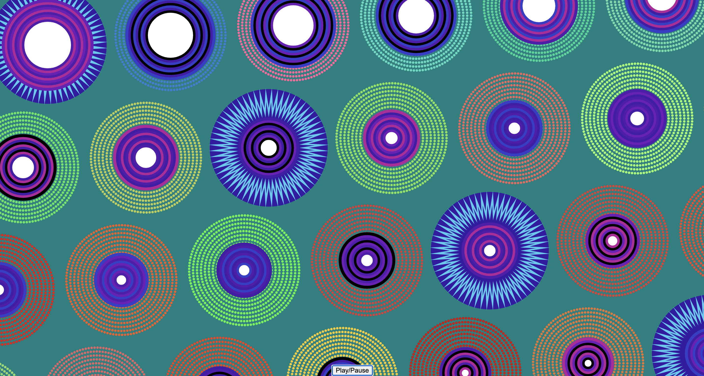

# jera0420_MajorProject


### **User Instruction**

Please click on the play/pause button to start or pause the music and animation.

For each circle pattern, there are two animations happening simultaneously: the inner circle size changes based on the audio's energy level, and the dotted outer circle colours change based on the audio's energy level. Each circle pattern represents a different frequency bin. Both animations are linked to the energy level to create a more hypnotic and synchronised user experience.

You are strongly encouraged to let the animation continue uninterruptedly through the entire audio so that you can experience the full range of changes with the music's crescendos and descrescendos. If you pause the animation, the music will be paused and restarted from the beginning when you press play again.

### **Creative Inspiration**

The choice of audio started with the thought of using emotional and classic production. The piece would have to offer a wide range of energy levels to make the animation more interesting. Vivaldi's Four Season Winter piece was the perfect fit!

[Audio file from Wikipedia Creative Commons](https://commons.wikimedia.org/wiki/File:Vivaldi_-_Four_Seasons_4_Winter_mvt_1_Allegro_non_molto_-_John_Harrison_violin.oga)

Since the audio that was chosen to animate this project is inspire by winter, I decided to also choose a winter colour palette to reflect its mood.
[Coolours Winter Palette](https://coolors.co/palette/f72585-b5179e-7209b7-560bad-480ca8-3a0ca3-3f37c9-4361ee-4895ef-4cc9f0)

The challenge was to get the colour of the dotted circle to follow a similar colour pattern, not going all the way to yellow or red, as shown in the variation 1 image below. 



I played with the setting until I was satisfied with the amount of variation and conformity, as in the variation 3 image below.


The hue wheel found on this website helped me achieve the desired results.
[Learn UI Design](https://www.learnui.design/blog/the-hsb-color-system-practicioners-primer.html)

The inspiration to make the inner circle change sizes while the outer circle changes colour came from our tutorial exercises. We only explored how to use audio once, and this was a challenging task. It was the most interesting audio animations I was able to complete, given my experience level. 


### **Technical Implementation**


The most relevant additions I made to the group code were the button and audio animations. I chose to use a single button for the audio and animations because both animations were linked to the same audio.

I preloaded an audio file before the setup function, controlling when to play and pause it with a button. The animations were also linked to the play and pause of the audio file, hence controlled by the same button. I extracted the energy levels with an FFT object (code lines 66, 68, and 80). Each circle pattern corresponded to a separate bin of the FFT spectrum (code lines 80 and 86-87).
[FFT - p5.js](https://p5js.org/reference/p5.sound/p5.FFT/)

For the animation, I created two methods inside the class. One to enable the change in radius size of the inner circle of circles and another for the colour variations in the dots of the outer circle (code lines 86-87). Then I mapped the audio's energy levels to these two methods, updateColor and updateRadius (code lines 127-140).

The group code was well-written and organised. Therefore, I did not have to make significant changes. The most important change I made was to create only as many circle patterns as needed the user's screen size, as opposed to always creating 280 circle patterns, which was the number needed for a screen size up to 98 inches. This change can be seen on the code lines 30-33, shown bellow.

```
let numCols = ceil((windowWidth - startX) / spacingX) + 1; 
let numRows = ceil((windowHeight - startY) / spacingY) + 1;
let numCircles = numCols * numRows;
```

This change was important for two reasons. First, the extra patterns were overloading the system, making the animation slow. Second, what was shown on the screen was not representative of the animation variance, since it was only showing a small part of the creations. Therefore, this change not only improved the speed but also the variance visualisation of the animation.

I ran into a problem I was not able to solve when looking at forums and reference pages, which was to create a condition that the number of bins in my code had to be compatible with the power of 2, one of the FFT rules. I used chatGPT for this operation, explaining what I needed. It recommended I use a condition called "while", which we have not seen in class. In week 4, we learned about if, else, if else, and switch, but not while. As explained in the link below, the while loop continues to execute the operation until it is true, according to the condition:
[While - MDN](https://developer.mozilla.org/en-US/docs/Web/JavaScript/Reference/Statements/while)

Here's the code snippet of the lines 35 to 38:

```
 let numBins = 16; // Start with the smallest power of 2 allowed for FFT
  while (numBins < numCircles && numBins < 1024) { // Maximum size allowed for FFT
    numBins *= 2;
  }
```

Explanation: 

The FFT parameter stipulates that its size must be between 16 and 1024, hence the decision for the starting and maximum number of bins. 
[FFT p5.js](https://p5js.org/reference/p5.sound/p5.FFT/)

Because our starting number is elevated to the power of 2, the final equation of numBins *=2 ensures that the following numbers multiplied by 2 continue to be within the power of 2. The first part of the condition "while numBins < numCircles" keeps running the operation when the numBins is smaller than the numCircles (until it is higher). "&&" ensures the second part of the condition is also true "numBins < 1024", only running the operation while the end result is smaller than the limit of 1024.

### **Group Animations**

Our group chose a varied approach to animating the code. While I animated the size of the radius of the inner circle and the colour of the dots of the outer circle according to the music's energy level, here is what my group members did:

**Ann**
1. The vertical position of the mouse across the screen dynamically changes the number of concentric dotted rings in each circle design.

2. Toggle between the dot and zigzag patterns, by clicking on any circle pattern.

3. "Move-away" effect enabled by pressing the space bar, patterns within a certain radius of the mouse will move away from it, resulting in a ripple effect.

**Jiawei**

Based on the visuals of the group code, he changed most of the code to use a particle system for creating the timed animations. The circles converge and change color.

**Meredith**
1. She is using perlin noise to randomize the initial x and y positions of the CirclePatterns.
    
2. She scaled the noise value to resize and rotate the dotted rings to make it a bit more ‘wheel-like’.


